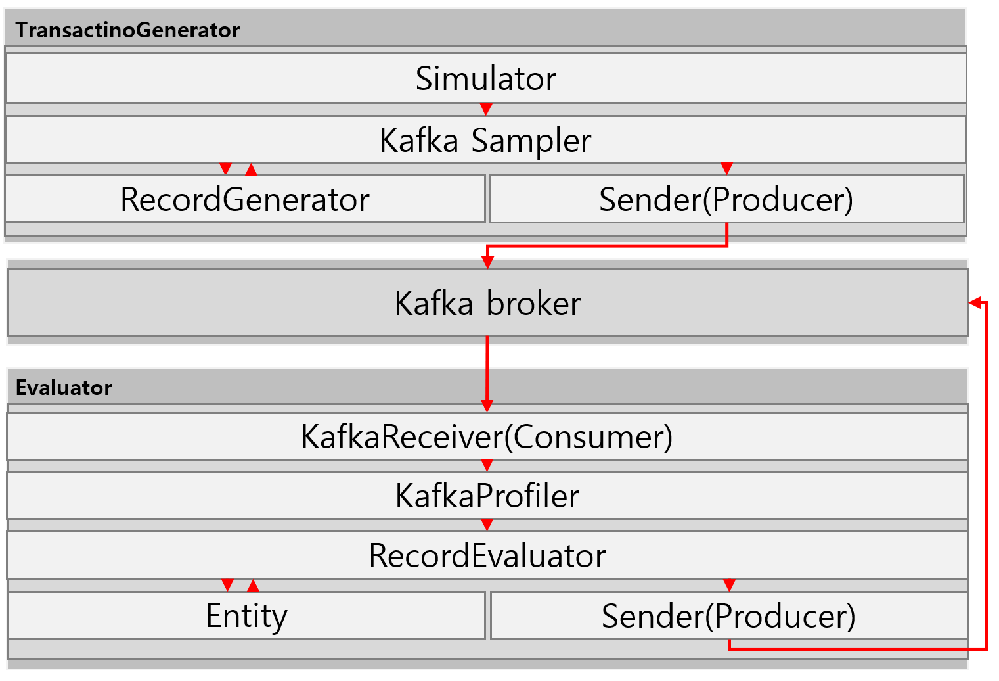

# Contents
1. [Architecture](#Architecture)
   1. [Program flow and processing](#Program-flow-and-processing)
2. [Getting Started](#Getting-Started)
    1. [Dependency](#Dependency)
    2. [Install](#Install)
    3. [Build](#Build)
       1. [Zookeeper](#Zookeeper)
       2. [Kafka](#kafka)
          1. [Topic](#Topic)
    4. [Monitoring](#Monitoring)
       1. [Consumer group](#Consumer-group)
       2. [Console consumer](#Console-consumer)
       3. [Log](#Log)
       4. [Database](#Database)
    5. [Config](#Config)
    6. [Run](#Run)
# Architecture

## Program flow and processing
1. Evaluator를 실행한다.
2. test라는 이름의 Consumer group을 생성한다.
3. Kafka broker에서 메시지를 가져온다.
4. 메시지의 type 필드 값에 따라 KafkaProfiler를 생성한다.
5. 각 도메인 별 Entity를 생성하여 Database에 데이터를 저장한다.
6. 특정 도메인인 경우 이상거래를 탐지하고 이상거래인 경우 필요한 데이터를 생성한다.
7. JSON String으로 변환한다.
9. Kafka Producer를 통해 메시지를 전송한다.
# Getting Started
## Dependency
- Java 8
## Install
```
tar zxf kakaobank_tasks_SUJeon.tar.gz
cd kakaobank_tasks_SUJeon/manager
```
## Build
### Zookeeper
```
sbin/install-zookeeper && sbin/configure-zookeeper && sbin/start-zookeeper
```
### Kafka
```
vi conf/nodes # write hostname of brokers
# 각 broker에 ssh 접속이 가능해야 합니다.
sbin/install-kafaka && sbin/configure-kafka && sbin/start-kafka
```
#### Topic
```
sbin/configure-kafka-topic
```
## Monitoring
### Consumer group
```
ssh -t `hostname` watch "'~/chain_data/kafka/bin/kafka-run-class.sh kafka.admin.ConsumerGroupCommand --group test --bootstrap-server localhost:9092 --describe'"
```
### Console consumer
```
~/chain_data/kafka/bin/kafka-console-consumer.sh --bootstrap-server localhost:9092 --from-beginning --topic fds.detections
```
### Log
```
vi $PROJECT_HOME/log/evaluator-yyyy-MM-dd.log
```
### Database
```
$PROJECT_HOME/data/h2_file.mv.db
```
## Config
1. '$PROJECT_HOME/src/main/java/com/kakaobank/evaluator/global/utils/DatabaseUtils'에서 Database 관련 설정을 변경할 수 있습니다.
2. '$PROJECT_HOME/src/main/java/com/kakaobank/evaluator/global/utils/KafkaUtils'에서 Kafka 관련 설정을 변경할 수 있습니다.
3. '$PROJECT_HOME/src/main/resources/logback.xml'에서 Log 관련 설정을 변경할 수 있습니다.
## Run
1. IDE에서 'evaluator' 프로젝트를 엽니다.
2. 'evaluator' 프로젝트 '$PROJECT_HOME/src/main/java/com/kakaobank/evaluator/exec/Evaluator'의 main 메서드를 실행합니다.
3. IDE에서 'transactiongenerator' 프로젝트를 엽니다.
4. '구성 편집 > 실행/디버그 구성'에서 '프로그램 인수'에 고객 수를 입력합니다.
5. 'transactiongenerator' 프로젝트 '$PROJECT_HOME/src/main/java/com/kakaobank/transactiongenerator/exec/Evaluator'의 main 메서드를 실행합니다.