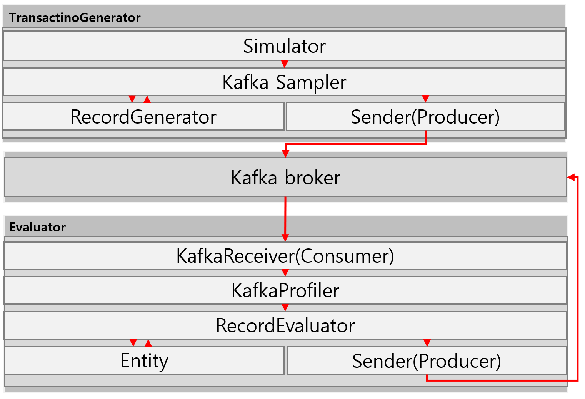

# Contents
1. [Architecture](#Architecture)
   1. [Program flow and processing](#Program-flow-and-processing)
2. [Getting Started](#Getting-Started)
   1. [Dependency](#Dependency)
   2. [Config](#Config)
   3. [Run](#Run)
# Architecture

## Program flow and processing
1. TransactionGenerator를 실행한다.
2. 로그 순서에 따라 KafkaSampler를 생성한다.
3. Util을 통해 각 컬럼 값에 맞는 임의 데이터를 생성한다.
4. JSON String으로 변환한다.
5. Kafka Producer를 통해 메시지를 전송한다.
# Getting Started
## Dependency
- Java 8
## Config
1. '$PROJECT_HOME/src/main/java/com/kakaobank/transactiongenerator/global/utils/KafkaUtils'에서 Kafka 관련 설정을 변경할 수 있습니다.
2. '$PROJECT_HOME/src/main/java/com/kakaobank/transactiongenerator/global/utils/SimulatorUtils'에서 시뮬레이션 관련 설정을 변경할 수 있습니다.
## Run
1. IDE에서 'evaluator' 프로젝트를 엽니다.
2. 'evaluator' 프로젝트 '$PROJECT_HOME/src/main/java/com/kakaobank/evaluator/exec/Evaluator'의 main 메서드를 실행합니다.
3. IDE에서 'transactiongenerator' 프로젝트를 엽니다.
4. '구성 편집 > 실행/디버그 구성'에서 '프로그램 인수'에 고객 수를 입력합니다.
5. 'transactiongenerator' 프로젝트 '$PROJECT_HOME/src/main/java/com/kakaobank/transactiongenerator/exec/Evaluator'의 main 메서드를 실행합니다.